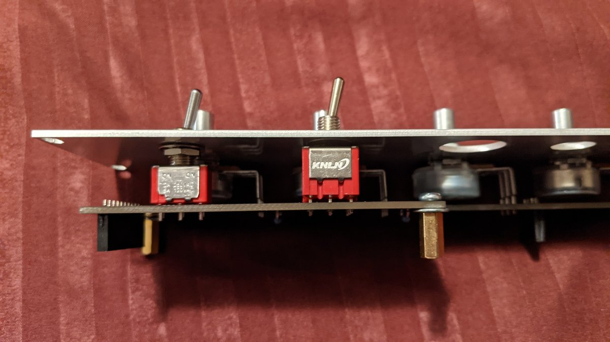
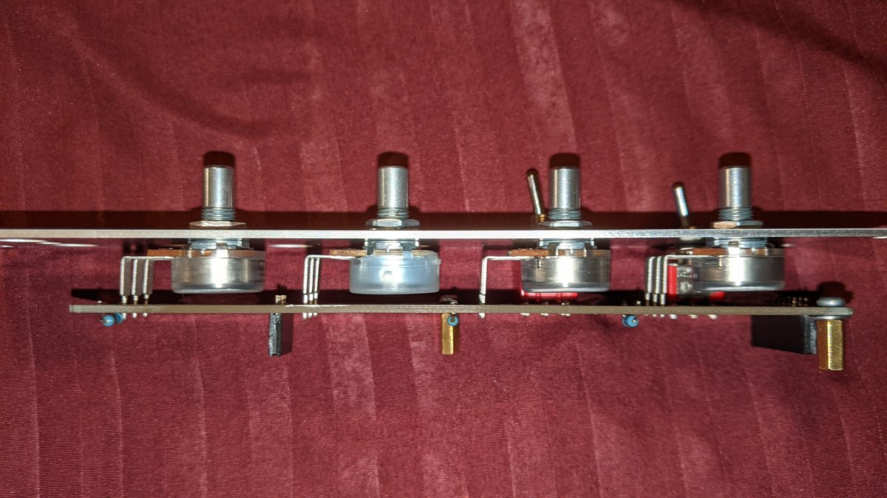
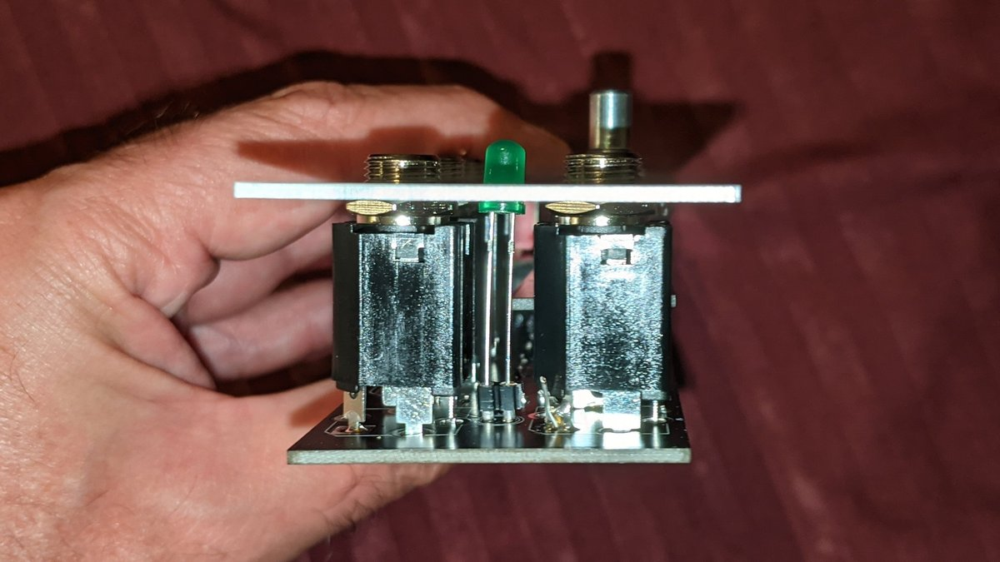

# Precision ADSR build notes

The build is pretty straightforward except for mechanical assembly, and one other thing:

## Timing capacitors

C10 and C11 are the capacitors that determine the envelope shape in conjunction with the four pots. The "Speed" switch selects whether C10 ("fast") or C11 ("slow") is used. 1 µF for C10 and 10 µF for C11 is suggested but you can try other values, smaller ones for faster timings and larger ones for slower.

In my tests, both aluminum electrolytic and tantalum caps caused the envelope's maximum to fall a little short of 8 V, and the sustain level to slope downwards with long gates. In both respects the tantalum did a little better, but not much. On the other hand a polyester film cap resulted in a maximum of 8 V and a flat sustain. Unfortunately 10 µF film caps are large and expensive, and ten 1 µF film caps in parallel would require an auxiliary board nearly as large as the main one. So my preference is a 1 µF film and a 10 µF tantalum.

If you want to experiment, you can. J6 is an optional SIP socket (you could use a pin header, but a SIP socket works better) for socketing the capacitors. There are 7 positions. As indicated by the lines on the silkscreen graphtics, the C11 + leg (if polarized) can go in either of the leftmost two positions, the C11 - leg in either of the next two, the C10 + leg in either of the next two, and the C10 - leg in the last one. This accommodates various possibilities for cap lead spacing. When and if you decide on a pair of capacitors you can solder them into the C10 and C11 footprints above the SIP socket.

## Mechanical assembly

Regarding the board mounted potentiometers, there are two overlapping footprints provided for each, allowing you to use your choice of 9 mm or 16 mm vertical pots. You can even use a mix of the two, if you want.

Putting everything together is a little complicated. At least it is if your 3PDT toggle switch, like mine, is a few mm taller than a DPDT toggle. In that case the pots and switches board ("Board B") must sit a few mm further from the front panel than usual.

At least with the components I used, I found:

* The SPDT toggle switch could be used with a nut under the front panel. I adjusted the height of that nut to match the height of the 3PDT switch. I did not use a nut behind the panel on the 3PDT switch.

* The 16 mm pots had long enough terminals, barely, to poke through the PCB enough for soldering with the pots mounted flush to the back of the front panel. This leaves a gap between the pots and the PCB.

If you use 9 mm pots, you're on your own!

* The jacks, like the SPDT switch, needed a nut behind the front panel. Tightening it down all the way to the jack body made the height about right. 

It's easier to tell in real life than in the photo that the front panel and PCBs are not quite parallel, but they're close.

* In the above photo you can also see my solution to getting the LED legs to reach. I mounted a 2-position SIP socket in the LED footprint and socketed the LED.

If I ever do a new version of this module I might panel mount the 3PDT so these issues don't arise. Then again, that would make for 7 wires to run, so maybe not. It works this way.

## Assembly order

I suggest the following procedure for assembly. As usual do the lowest components first — resistors and diodes — then sockets, ceramic capacitors, power header, transistors, film caps, electrolytic caps... something like that.

To do the pin headers and sockets, first attach spacers on the non component side of Board B. (I used 10 mm spacers plus a washer.) Next mate the headers and sockets. Place the header pins in the Board A footprints. Make sure to put them on the non component side. Don't solder anything. Put Board B on, pot and switch footprints side up, with the socket pins going into their footprints. Don't solder anything. Screw the other ends of the spacers to Board A. Now solder the pin headers and sockets in place.

To mount the potentiometers and switches, separate the two boards again. Place the pots and switches on their footprints on Board B. Don't solder anything. Adjust the nut height on the SPDT switch. Place the front panel over the pots and switches so it is flush with the top of the 3PDT switch and more or less parallel to the board. The SPDT nut should be against the back of the panel. Add washers and nuts, finger tight, to all pots and switches. Verify the pot terminals get through the PCB. Now solder the pots and switches.

To mount the jacks and LED, place the jacks on their footprints on Board A and the LED in the SIP socket. Don't solder anything. Adjust the nut heights on the jacks and verify the height of the LED, trimming its legs as needed. Mate Board A to Board B with the jacks and LED going through their panel holes; the LED and the nuts on the jacks should be against the back of the panel. Add washers and nuts, finger tight, to all jacks. Now solder the jacks.

The push button switch goes into the hole on the front panel and then stranded wires run from its terminals to a 2-pin Molex connector. Wires should be long enough to reach the Molex header on Board A. They can be routed through the notch on the edge of Board A.