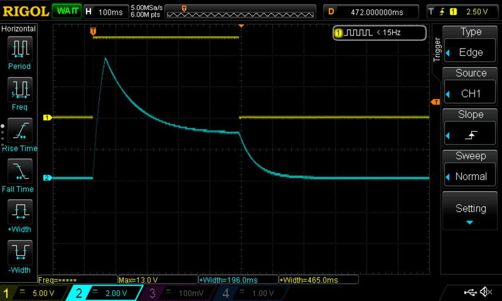
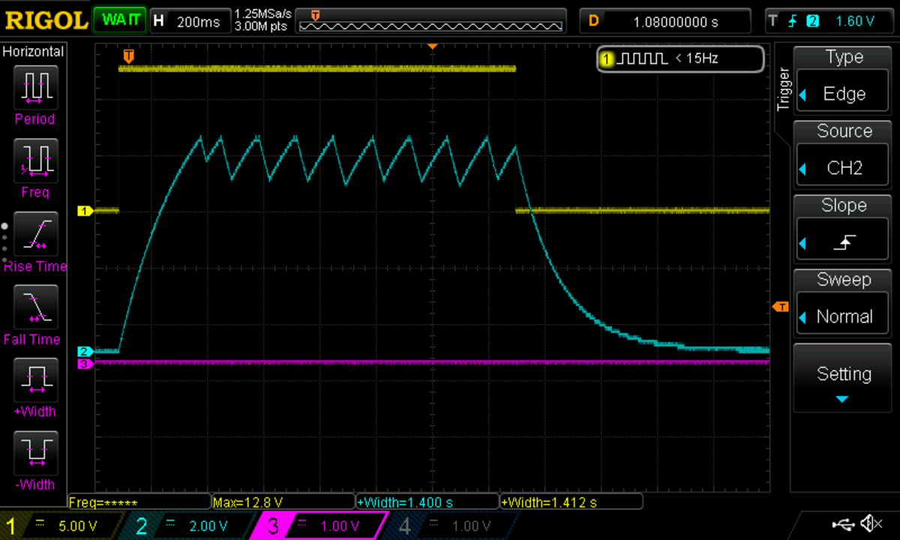
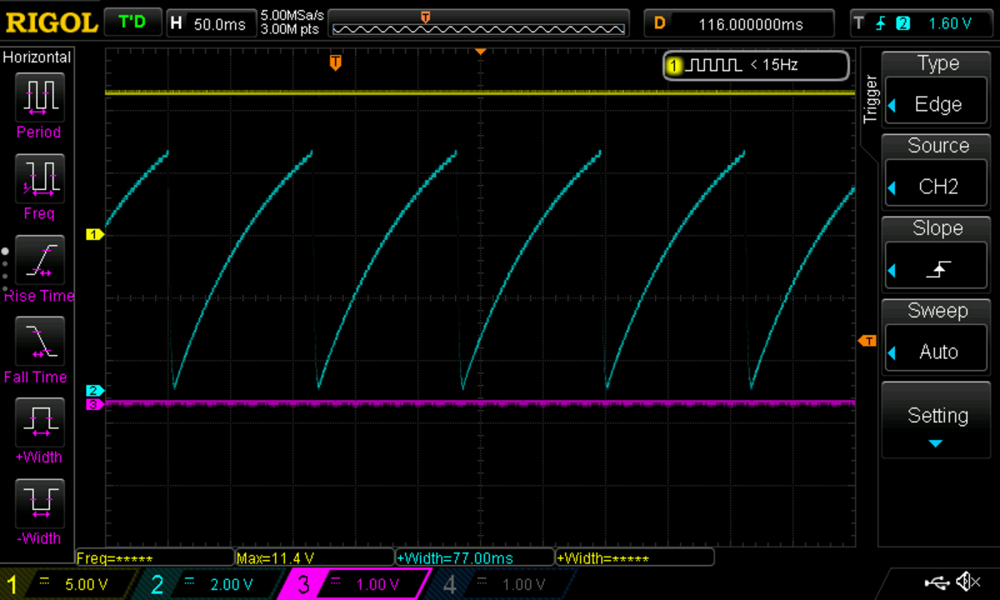

# Using the Precision ADSR with retriggering and looping

## Gated ADSR operation

It's just like pretty much any ADSR envelope generator. Put a gate into the Gate In jack (or generate a gate manually using the push button). The start (rising edge) of the gate will initiate the attack, followed by the decay to the sustain level after maximum amplitude is reached (about 8 V). The end (falling edge) of the gate will initiate the release to 0 V. Attack, Decay, and Release times, and Sustain level, are set using the knobs. The Speed switch allows choosing faster or slower time ranges for the Attack, Decay, and Release times.

## Inverted output

Whatever appears on the Env output, its negative will appear on the ~Env output. You can use this, for instance, to duck a VCA level using a gate.

## Retriggering

It can be useful to have a new Attack/Decay for new notes without a release to 0 V before them. To do this send a gate to the Gate In (or push the button) and triggers to Retrig In. As usual the gate will initiate an Attack, Decay, Sustain, and Release. However, pulses on the Retrig In jack during the Decay/Sustain phase will cause new Attacks and Decays to occur.

## Looping

With the Looping switch in the On position, a gate on the Gate In (or pushing the button) will initiate an Attack and Decay to 0 V. The Sustain level and Release times are ignored. When the output gets close to 0 V it will automatically trigger a new Attack and Decay. The Attacks and Decays will repeat as long as the gate is on. When the gate goes off the looping ends.

If nothing is plugged in on the Gate In jack and Looping is turned on, Attacks and Decays will repeat continuously.

